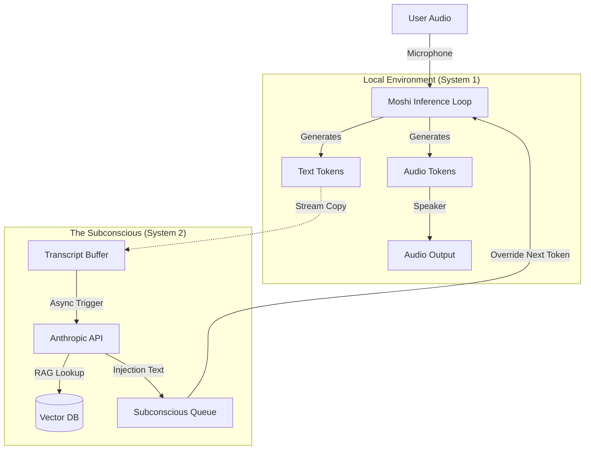

# Technical Design: Bicameral Moshi Architecture

## "The Subconscious Injection Pattern"

### 1\. Architectural Concept

The goal is to create a "Split-Brain" AI where:

1.  **System 1 (Conscious - Moshi):** Handles the immediate, millisecond-latency social loop (prosody, fillers, listening, simple replies).
2.  **System 2 (Subconscious - Anthropic):** Handles deep reasoning, RAG, and factual verification in the background.

Unlike standard "Interrupt" patterns which silence the TTS to play a new clip, this architecture uses **Token Injection**. We leverage the fact that Moshi generates *Text Tokens* (Inner Monologue) milliseconds before it generates *Audio Tokens*. By manipulating the text stream, we effectively "inception" a thought into Moshi's mind, which it then verbalizes using its own voice and prosody.

### 2\. System Diagram



### 3\. Implementation Strategy

The implementation requires forking the standard `moshi` inference loop. We will introduce a `SubconsciousBridge` class that runs in a separate thread.

#### A. The "Subconscious Bridge" (Background Thread)

This component accumulates the conversation history and decides when to consult the "Big Brain" (Anthropic).

**Key Logic:**

  * **VAD Gating:** Only send queries to Anthropic when the user is speaking or during long pauses.
  * **Hallucination Check:** Anthropic is prompted to return `NULL` if the current conversation flow is accurate. It only returns text if it detects a missing fact or helpful addition.

#### B. The "Transition Engine" (Injection Logic)

To prevent the "Robot Glitch" effect, we cannot simply drop facts into the stream. We must wrap them in **Pivot Phrases** that make sense for a speaker realizing something mid-sentence.

  * *Pivot Examples:* "Actually, I just remembered...", "Wait, looking at the data...", "Oh, and also..."

#### C. The Modified Inference Loop

We override the standard `LMGen` loop. At every step, before Moshi predicts the next token, we check the `SubconsciousQueue`. If data is present, we **force** the next text tokens to match our injection.

### 4\. Code Implementation Guide

Below is the conceptual Python implementation. This logic replaces the standard inference loop in your server.

```python
import threading
import queue
import time
import random
from moshi.models import LMGen

# --- 1. The Subconscious Mind ---
class SubconsciousBridge:
    def __init__(self, tokenizer, anthropic_client):
        self.tokenizer = tokenizer
        self.client = anthropic_client
        self.transcript_buffer = ""
        self.injection_queue = queue.Queue()
        self.running = True
        
        # Phrases to smooth the insertion of external memories
        self.pivots = [
            " actually, I just realized ",
            " oh, and looking at the details, ",
            " wait, I recall that ",
            " correction, "
        ]

    def start(self):
        threading.Thread(target=self._monitor_loop, daemon=True).start()

    def add_to_transcript(self, text):
        self.transcript_buffer += text

    def _monitor_loop(self):
        """
        Constantly watches the transcript. If it sees a need for RAG/Reasoning,
        it queries Anthropic and queues the result.
        """
        while self.running:
            time.sleep(2) # Don't spam the API
            
            # Heuristic: Only query if buffer has changed significantly
            if len(self.transcript_buffer) > 50: 
                self._query_brain()

    def _query_brain(self):
        # This prompt is critical. It tells Anthropic to be a "silent observer"
        system_prompt = (
            "You are the subconscious memory of an AI assistant. "
            "Read the current transcript. If the assistant is missing a fact "
            "or needs to use a tool, output the CORRECT sentence to say next. "
            "If the conversation is fine, output NOTHING."
        )
        
        response = self.client.generate(
            system=system_prompt,
            user=self.transcript_buffer[-1000:] # Last 1000 chars context
        )

        if response.text:
            # We found a thought! Wrap it in a pivot.
            pivot = random.choice(self.pivots)
            full_thought = f"{pivot}{response.text}"
            
            # Tokenize immediately to save time in the main loop
            tokens = self.tokenizer.encode(full_thought)
            
            # Push to queue for the main loop to consume
            self.injection_queue.put(tokens)

# --- 2. The Conscious Loop (Main Thread) ---
def run_bicameral_inference(model, mimi, tokenizer, bridge):
    """
    Modified version of moshi.run_inference
    """
    
    # Initialize model states
    prev_text_token = start_token
    prev_audio_tokens = start_audio_token
    
    # Buffer to hold injected tokens we are currently "forcing"
    forced_token_buffer = []

    while True:
        # --- Step A: Check for Injections ---
        if not bridge.injection_queue.empty() and not forced_token_buffer:
            # Load the new thought into our forced buffer
            forced_token_buffer = bridge.injection_queue.get()
            print(f"\n[SUBCONSCIOUS INJECTION TRIGGERED]")

        # --- Step B: Determine Next Text Token ---
        override_token = None
        if forced_token_buffer:
            # Override Moshi's free will. Force the next token from our buffer.
            # We pop the first token from our injection sequence
            override_token = forced_token_buffer.pop(0)
            
            # CRITICAL: Manually set the model's internal "last text" state
            # This forces the audio generation to align with our injected text
            if hasattr(model, 'last_text_tokens'):
                model.last_text_tokens = override_token

        # --- Step C: Run Moshi Step ---
        # Moshi generates Audio conditioned on the text token we just decided on.
        # If we forced the text token, Moshi will "read" it in its own voice.
        next_text, next_audio = model.step(
            audio_tokens=prev_audio_tokens
            # Note: Some implementations of step() take text_token as arg,
            # others require setting the attribute as done in Step B.
        )

        # --- Step D: Update State & Output ---
        
        # If we are forcing tokens, we ignore Moshi's predicted next text 
        # and continue using our buffer in the next loop.
        if forced_token_buffer:
             prev_text_token = next_text # Keep the loop moving
        else:
             prev_text_token = next_text
        
        prev_audio_tokens = next_audio
        
        # Stream audio to speaker
        mimi.decode_and_play(next_audio)
        
        # Send "What I just said" to the brain so it knows the injection happened
        decoded_word = tokenizer.decode(prev_text_token)
        bridge.add_to_transcript(decoded_word)
```

-----

### Where to apply this in the Codebase

If you are using the official **Kyutai Moshi repository**, the file you need to modify is likely:

**`moshi/server.py`**

Specifically, look for the `run` method inside the `Server` or `Worker` class. You will find a loop that looks approximately like this:

```python
# ORIGINAL MOSHI CODE (Approximate)
while True:
    # ... get user audio ...
    tokens = self.lm_gen.step(audio_codes) 
    # ... decode audio ...
```

You need to wrap `self.lm_gen.step` with the check for your `injection_queue`.

If you are using the **Rust server** (`moshi-server`), you cannot use this Python logic directly. You would need to implement the bridge in Rust or switch to the Python-based server (`python -m moshi.server`) which is easier to modify but slightly less performant.