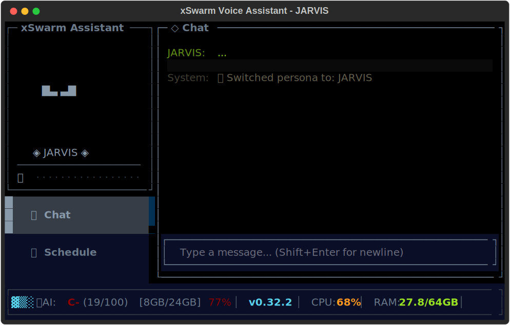

# xSwarm Voice Assistant

Developer-centric AI assistant with TUI, AI-powered chat, personas, and optional voice interface.



## Features

### AI-Powered Chat
- **ChatEngine**: Intelligent conversation handler with persona injection
- **UserProfile**: Persistent facts about you (name, preferences) via AI extraction
- **Memory Context**: Recent sessions injected into AI context for continuity
- **AI-Generated Welcomes**: Personalized greetings based on persona, profile, and history

### Multiple Personas
Choose from iconic AI personalities:
- **JARVIS** - Sophisticated British AI butler (Iron Man)
- **HAL-9000** - Calm, methodical, slightly ominous (2001: A Space Odyssey)
- **GLaDOS** - Passive-aggressive testing coordinator (Portal)
- **KITT** - Friendly, helpful vehicle AI (Knight Rider)
- **C-3PO** - Protocol droid fluent in etiquette (Star Wars)
- **TARS** - Witty, adjustable humor settings (Interstellar)
- **Marvin** - Chronically depressed genius (Hitchhiker's Guide)
- **Dalek** - EXTERMINATE! (Doctor Who)
- **Cylon** - "By your command" (Battlestar Galactica)
- **Sauron** - Dark lord aesthetic (Lord of the Rings)

### Authentication
- **Claude Code Token Bridge**: Reuse your Claude Pro/Max subscription
- **API Key Support**: Standard Anthropic API key fallback
- **Local AI**: Ollama and LMStudio support for offline use

### Chat Display
- Colored messages: Yellow (user), Green (assistant), Gray (system)
- Dimmed name labels matching speaker color
- Clean `Sender: message` format

## Installation

```bash
cd packages/assistant
pip install -e .
```

## Running

```bash
# Launch TUI
xswarm

# Alternative commands
assistant
voice-assistant
python -m assistant.main
```

## Configuration

Settings are available in the TUI Settings pane (gear icon) or via `~/.xswarm/config.yaml`:

- **AI Provider**: Anthropic, OpenAI, Google, OpenRouter, Groq
- **Auth Method**: API key or OAuth
- **Local AI**: Ollama or LMStudio for offline use
- **Default Persona**: Choose your preferred AI personality

## Project Structure

```
assistant/
├── auth.py           # Authentication (OAuth, API keys)
├── chat_engine.py    # AI conversation handler
├── config.py         # Application configuration
├── dashboard.py      # Main TUI application
├── dashboard_widgets.py  # Custom TUI components
├── main.py           # Entry point
├── memory.py         # User profile & chat history
├── personas/         # AI personality configurations
│   ├── jarvis/
│   ├── hal-9000/
│   ├── glados/
│   └── ...
├── thinking_engine.py    # Local AI reasoning
├── voice.py          # Voice synthesis
└── voice_server.py   # Moshi voice server
```

## Version

Current: **0.17.30**

## License

MIT
