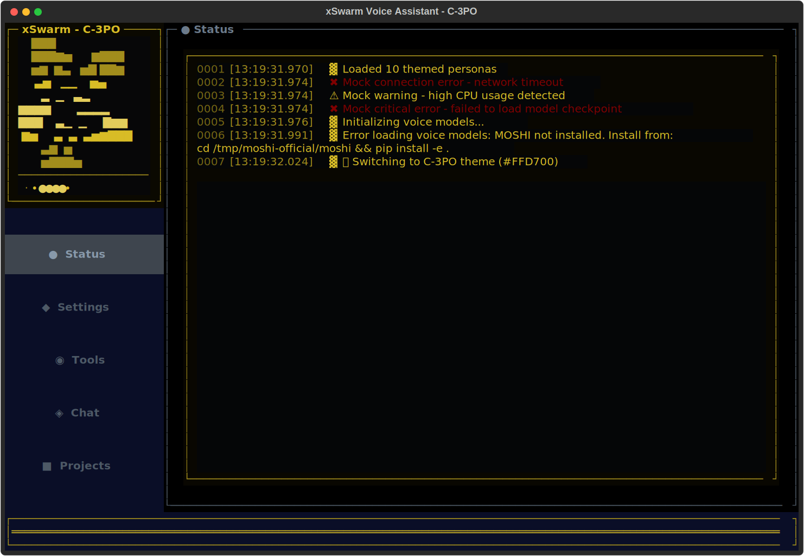

# Voice Assistant - Moshi + ThinkingEngine

A complete voice-first personal assistant that uses **Moshi MLX** as the real-time voice interface, enhanced with **personality**, **memory**, **thinking**, and **tools** to create a full-featured AI assistant.

## Architecture Overview

```
┌─────────────────────────────────────────────────────────────────┐
│                        TUI Dashboard                            │
│  (Textual app with visualizer, chat, activity feed)             │
└─────────────────────┬───────────────────────────────────────────┘
                      │
          ┌───────────┴───────────┐
          │                       │
          ▼                       ▼
┌─────────────────┐    ┌─────────────────────────┐
│  Voice Server   │    │   Thinking Engine       │
│  (ZeroMQ daemon)│    │   (Claude Haiku/Sonnet) │
│                 │    │                         │
│  • Moshi MLX    │◄───┤  • Decision making      │
│  • Audio I/O    │    │  • Memory search        │
│  • Transcript   │────►  • Tool execution       │
│  • Context      │    │  • Context injection    │
└─────────────────┘    └─────────────────────────┘
         │                        │
         │                        ▼
         │              ┌─────────────────┐
         │              │  Tool Registry  │
         │              │  • Email        │
         │              │  • Phone        │
         │              │  • Memory       │
         │              └─────────────────┘
         │
         ▼
   ┌───────────┐
   │   User    │
   │  (voice)  │
   └───────────┘
```

### How It Works

1. **Moshi** handles real-time voice conversation (listen + speak simultaneously)
2. **ThinkingEngine** monitors both user input and Moshi's output
3. When action is needed, **Claude Haiku** decides what to do (search memory, call tool, inject context)
4. **Claude Sonnet 4.5** summarizes results tersely for Moshi's small ~3000 token context
5. Context is injected back into Moshi to inform its responses

### Key Components

- **Voice Server** (`voice_server.py`): ZeroMQ daemon running Moshi MLX in separate process for Metal GPU
- **ThinkingEngine** (`thinking_engine.py`): Background system monitoring conversations, deciding on actions
- **Tool Registry** (`tools/`): Email, phone, memory search, theme changes
- **Persona System** (`personas/`): YAML-based personality configs with traits and system prompts
- **Memory Manager** (`memory.py`): Conversation history with server fallback

---

## Quick Start

### Installation

```bash
cd packages/assistant

# Install Python dependencies
pip install -r requirements.txt

# Or install in development mode
pip install -e ".[dev]"

# Download Vosk model for wake word detection
python scripts/download_vosk_model.py

# Install MOSHI from source (required for Phase 2)
cd /tmp
git clone https://github.com/kyutai-labs/moshi.git moshi-official
cd moshi-official/moshi
pip install -e .
cd -
```

### Setup Environment

```bash
# Copy environment template
cp .env.example .env

# Edit .env with your settings
# XSWARM_SERVER_URL=http://localhost:3000
# XSWARM_API_TOKEN=your-token
```

### Run the Assistant

```bash
# Run with default settings (launches interactive TUI)
python -m assistant.main

# Or use the CLI entry point (after pip install)
assistant

# Or the full name
voice-assistant

# First run will show setup wizard
assistant

# Run with debug logging
assistant --debug

# Use custom config file
assistant --config /path/to/config.yaml
```

## Interactive TUI Interface



The assistant is a **fully interactive TUI application** - all configuration happens inside the interface, not via command-line flags.

### First-Run Setup Wizard

On first launch, you'll see a welcome wizard that guides you through:

1. **Persona Selection** - Choose your assistant's personality
2. **Device Selection** - Auto-detect or manually select compute device (MPS, CUDA, CPU)
3. **Wake Word** - Set your activation phrase (e.g., "jarvis", "computer")
4. **Memory Server** - Configure memory server connection (optional)

Configuration is saved to `~/.config/xswarm/config.yaml` and persists between runs.

### Keyboard Controls

Once running, the TUI provides these keyboard shortcuts:

- **`s`** - Open settings (change any configuration)
- **`SPACE`** - Toggle listening mode
- **`q`** - Quit application

### Settings Screen

Press `s` at any time to open the interactive settings screen where you can modify:

- Active persona
- Compute device (auto/mps/cuda/cpu)
- Wake word phrase
- Memory server URL
- API token
- Enable/disable memory integration

All changes are saved immediately to your config file.

## Command Line Options

Only development and testing flags are available:

```
usage: assistant [-h] [--config CONFIG] [--debug] [--version]

Voice Assistant with MOSHI - Interactive TUI

optional arguments:
  -h, --help            show this help message and exit
  --config CONFIG       Path to custom config file
  --debug               Enable debug logging
  --version             show program's version number and exit

Examples:
  assistant                    # Launch interactive TUI
  assistant --debug            # Launch with debug logging
  assistant --config /path     # Use custom config file

Configuration:
  All settings are configured interactively in the TUI.
  Press 's' inside the app to open settings.
  Config saved to: ~/.config/xswarm/config.yaml
```

## Testing the TUI

### Overview

All TUI testing runs in **headless mode** (no terminal corruption!). Perfect for automated testing and AI collaboration.

### Install Test Dependencies

```bash
pip install -e ".[dev]"
```

This installs:
- `pytest` - Test framework
- `pytest-asyncio` - Async test support
- `pytest-cov` - Coverage reporting
- **`pytest-textual-snapshot`** ⭐ - Visual snapshot testing

### Run Tests

```bash
# Run all tests
pytest tests/ -v

# Run snapshot tests (visual regression testing)
pytest tests/test_*_snapshots.py -v

# Run specific test file
pytest tests/test_integration.py -v
pytest tests/test_chat_panel_snapshots.py -v

# Run with coverage
pytest tests/ --cov=assistant --cov-report=html

# Update visual baselines (after intentional UI changes)
pytest tests/test_*_snapshots.py --snapshot-update
```

### Generate SVG Screenshots for AI Review

Perfect for verifying visual changes without running the full app:

```bash
# Generate all component screenshots (headless, no terminal corruption)
python scripts/generate_test_svgs.py

# Generate specific components
python scripts/generate_test_svgs.py --component chat
python scripts/generate_test_svgs.py --component voice

# Custom terminal size
python scripts/generate_test_svgs.py --size 120x40

# See all options
python scripts/generate_test_svgs.py --help
```

Output: `tmp/ai_review/*.svg` (open in browser to view)

### Visual Snapshot Testing

The snapshot tests automatically detect visual regressions by comparing current output against baseline snapshots:

```bash
# Run snapshot tests
pytest tests/test_chat_panel_snapshots.py -v

# If visual changed unintentionally:
#   → Review HTML diff report: tests/__snapshots__/report.html
#   → Fix the bug
#   → Re-run tests

# If visual changed intentionally:
pytest tests/test_chat_panel_snapshots.py --snapshot-update
```

**Key Benefits:**
- ✅ No terminal corruption (runs in headless mode)
- ✅ Automated visual regression detection
- ✅ AI can generate and review screenshots
- ✅ Fast feedback loop (seconds)

### Documentation

For detailed testing workflows, best practices, and troubleshooting, see:

📖 **[docs/testing-guide.md](docs/testing-guide.md)**

**Topics covered:**
- Headless testing architecture
- Writing new snapshot tests
- AI collaboration workflow
- Continuous integration setup
- Troubleshooting common issues

## 🚀 Planned Features (Free Forever)

xswarm aims to be the most addictive, customizable, and viral AI assistant TUI. Here's our ambitious roadmap for the **free base version**:

### 🎨 Ultimate Customization & "Ricing"
- **Plugin System** - Dynamic plugin loading, hot-reload, community marketplace
- **Theme Gallery** - Browse, download, and share custom themes with one click
- **Pywal Integration** - Auto-sync colors with your wallpaper (r/unixporn approved!)
- **Persona Themes** - Each AI personality has unique colors, ASCII art, and style
- **Live Theme Preview** - See changes in real-time before applying
- **System Color Sync** - Adapt to Omarchy, macOS, GTK, Windows themes automatically

### 🔍 Productivity Powerhouse
- **File Search** - Lightning-fast fuzzy file search with preview (replaces `find` + `grep`)
- **Note Search** - Full-text + semantic search across all your documents (Whoosh + ChromaDB)
- **Task Manager** - Beautiful Kanban board widget, SQLite backend, voice-to-task
- **Quick Actions** - Clipboard manager, screenshots, text snippets
- **Web Research** - Built-in scraper for articles, prices, data extraction

### 🎯 Voice & AI Features
- **Voice Commands** - Natural language control of all features
- **Multiple Personas** - JARVIS (professional), GLaDOS (sarcastic), NEON (cyberpunk), and more
- **Custom Personas** - Create and share your own AI personalities
- **Local Transcription** - Offline meeting transcription with Whisper (100% private)
- **Voice-to-Task** - "Add task: fix bug" instantly creates todo item

### 📊 System Integration
- **System Monitor** - Live CPU/GPU/memory/network stats in TUI
- **Device Indicators** - Battery, temperature, disk usage
- **Process Manager** - Kill processes, monitor resource hogs
- **Clipboard History** - Never lose a copy again

### 🎭 Community & Viral Features
- **Rice Showcase** - Share your setup with screenshots + theme files
- **Plugin Marketplace** - Discover and install community plugins
- **Theme Rating** - Upvote favorite themes, "Setup of the Week"
- **One-Click Install** - "Share my rice" generates shareable setup
- **Plugin Developer Tools** - Easy plugin creation with templates

### 🔐 Privacy-First Design
- **100% Local** - All base features work offline
- **No Telemetry** - Zero tracking or analytics
- **Open Source** - Fully auditable code
- **Self-Hosted** - Your data never leaves your machine
- **E2E Encryption** - Optional cloud sync with end-to-end encryption

### 🎨 Visual Polish
- **Responsive TUI** - Works at any terminal size (40x15 to 4K)
- **Progressive Degradation** - Graceful feature reduction on small screens
- **60 FPS Animations** - Smooth, buttery animations
- **ASCII Art** - Persona avatars with character
- **Matrix Rain** - Optional cyberpunk background effect
- **Glow Effects** - Neon-style text glowing

### 🔌 Built-in Plugins (Free)
All these plugins ship with the base install:

1. **file-search** - Fuzzy file finder with preview
2. **note-search** - Full-text note search
3. **task-manager** - Kanban board for todos
4. **system-info** - Live system stats
5. **quick-actions** - Clipboard, screenshots, snippets
6. **web-research** - Article scraper and summarizer
7. **theme-gallery** - Browse and install community themes
8. **persona-manager** - Switch AI personalities

### 💎 Premium Features (Optional, BYOK)
These are **optional** for power users. Base version is amazing without them:

- **Email Suite** - Gmail API integration (bring your own API key)
- **Calendar Sync** - Google Calendar sync (BYOK)
- **Cloud Backup** - E2E encrypted cloud sync (optional paid service)
- **Premium AI Models** - GPT-4, Claude API (BYOK)
- **Workflow Automation** - Advanced task scheduling (APScheduler/Celery)
- **Team Features** - Shared plugins, themes, workspaces

**Philosophy:** Give away the sizzle, sell the steak. Base version is so good users will want to share it.

---

## What's Implemented

### Core: Voice Server (ZeroMQ + Moshi MLX) ✅
- ✅ ZeroMQ daemon for Moshi MLX (`assistant/voice_server.py`)
- ✅ Separate process for Metal GPU utilization
- ✅ Three-port architecture (commands, audio in, audio out)
- ✅ Real-time duplex audio streaming
- ✅ Transcript monitoring with polling API
- ✅ Context injection for persona/memory/tools
- ✅ VoiceServerClient for easy integration

### Core: Thinking Engine ✅
- ✅ ThinkingEngine class (`assistant/thinking_engine.py`)
- ✅ Two-step architecture: Haiku (decision) + Sonnet (summarization)
- ✅ Monitors user input and Moshi output
- ✅ Automatic memory search when relevant
- ✅ Tool execution with result injection
- ✅ Terse summarization for Moshi's small context
- ✅ Callbacks for UI notifications

### Core: Tool System ✅
- ✅ ToolRegistry with JSON schema generation (`assistant/tools/registry.py`)
- ✅ Email tool via SendGrid (`assistant/tools/email_tool.py`)
- ✅ Phone tool via Twilio (`assistant/tools/phone_tool.py`)
- ✅ Theme change tool (`assistant/tools/theme_tool.py`)
- ✅ Memory search tool (built into ThinkingEngine)
- ✅ Async handlers with structured results

### Dashboard: Textual TUI ✅
- ✅ Main TUI application (`assistant/dashboard/app.py`)
- ✅ Voice visualizer with dual circles (mic/output)
- ✅ Activity feed with timestamps
- ✅ Chat panel with history
- ✅ Settings screen
- ✅ Multiple tab views (status, settings, tools, chat, projects, schedule, workers)
- ✅ Persona theme integration
- ✅ 30 FPS smooth animations

### Persona System ✅
- ✅ PersonaConfig with Pydantic models (`assistant/personas/config.py`)
- ✅ PersonaManager for loading/switching (`assistant/personas/manager.py`)
- ✅ Big Five personality traits + custom dimensions
- ✅ External YAML configuration
- ✅ System prompt generation from traits
- ✅ Theme colors per persona

### Memory Integration ✅
- ✅ MemoryManager with server fallback (`assistant/memory.py`)
- ✅ Conversation history storage
- ✅ Context retrieval for LLM
- ✅ Local cache for offline operation

### Wake Word Detection ✅
- ✅ Vosk-based offline detection (`assistant/wake_word/detector.py`)
- ✅ Multiple wake words (all persona names + common phrases)
- ✅ <100ms latency, deterministic

### Infrastructure ✅
- ✅ Hardware detection (GPU type, memory)
- ✅ Service selection based on capabilities
- ✅ Singleton lock for single instance
- ✅ Graceful shutdown

## Architecture

### Voice Backend: Moshi MLX
- **Mac M-series**: Moshi MLX on Metal GPU (primary)
- Runs in separate process for GPU isolation
- Quantized models: Q4 (fast), Q8 (balanced), BF16 (quality)
- Real-time full-duplex audio (listen + speak simultaneously)

### AI Models
- **Moshi**: Voice conversation (MLX, local)
- **Claude Haiku**: Quick decisions in ThinkingEngine
- **Claude Sonnet 4.5**: Smart summarization for context injection

### TUI Framework: Textual ✅
- Modern async/await
- Voice visualizer with dual amplitude circles
- Real-time activity feed
- 30 FPS animations
- Multi-tab navigation

### Persona System: External YAML configs ✅
- Directory-based (`packages/personas/`)
- Hot-reloadable
- Pydantic models for validation
- Big Five + custom personality traits
- Theme colors and system prompts

### Tool System ✅
- Registry with JSON schema for LLM
- Email (SendGrid), Phone (Twilio)
- Memory search
- Extensible async handlers

### Wake Word Detection: Vosk ✅
- Offline (no API calls)
- Lightweight (~40MB model)
- <100ms latency
- Multiple wake words per session

### Memory Integration ✅
- Async httpx client for Node.js server
- Automatic fallback to local cache
- Conversation history for ThinkingEngine

---

## Voice Server (ZeroMQ)

The voice server runs Moshi MLX in a separate process for proper Metal GPU utilization. Communication happens over ZeroMQ sockets.

### Architecture

```
┌─────────────┐     ZeroMQ      ┌──────────────┐
│   TUI App   │ ◄─────────────► │ Voice Server │
│             │   Port 5555     │              │
│ VoiceServer │   (commands)    │  Moshi MLX   │
│   Client    │                 │  Audio I/O   │
│             │   Port 5556     │  Transcript  │
│             │ ◄─────────────► │              │
│             │   (audio in)    │              │
│             │                 │              │
│             │   Port 5557     │              │
│             │ ◄─────────────► │              │
└─────────────┘   (audio out)   └──────────────┘
```

### Server API

The voice server exposes these commands via ZeroMQ:

```python
from assistant.voice_server import VoiceServerClient

client = VoiceServerClient()

# Persona & Context
client.set_persona(name, system_prompt, traits)
client.inject_context("User prefers dark themes")
client.inject_tool_result("email", "Sent to chad@example.com")

# Conversation History
client.get_history()
client.inject_history([...])
client.clear_history()

# Transcript Monitoring
client.get_transcript()      # Full conversation
client.get_new_text()        # New text since last call (for polling)
client.clear_transcript()

# Context Management
client.get_context_usage()   # Track ~3000 token budget

# Audio Streaming
client.send_audio(samples)   # Mic input to Moshi
client.recv_audio()          # Moshi output + amplitudes
```

### Starting the Server

The server is started automatically by `main.py` before launching the TUI:

```python
from assistant.voice_server import start_server_process

# Start in separate process
process = start_server_process(quality="q4")  # or "q8", "bf16"

# Server runs on localhost:5555 (commands), 5556 (audio in), 5557 (audio out)
```

---

## Thinking Engine

The ThinkingEngine monitors conversations and decides when to use tools, search memory, or inject context.

### Two-Step Architecture

1. **Decision (Claude Haiku)** - Fast, cheap
   - Analyzes recent conversation
   - Decides: search memory? execute tool? inject context? do nothing?

2. **Summarization (Claude Sonnet 4.5)** - Smart, quality
   - Takes raw data from tools/memory
   - Creates terse 2-3 sentence summaries
   - Max 150 tokens to fit Moshi's ~3000 token context

### How It Works

```python
from assistant.thinking_engine import ThinkingEngine

engine = ThinkingEngine(
    voice_client=client,
    memory_manager=memory,
    user_id="user-123"
)

# Callbacks for UI updates
engine.on_injection = lambda ctx: print(f"Injected: {ctx}")
engine.on_tool_result = lambda name, result: print(f"Tool: {name}")

await engine.start()

# Engine now monitors:
# - User input (via process_user_input())
# - Moshi output (via polling get_new_text())
```

### Available Tools

The ThinkingEngine can execute these tools:

- **send_email** - Send email via SendGrid
- **make_call** - Make phone call via Twilio
- **search_memory** - Search conversation history
- **change_theme** - Switch TUI color theme

### Example Flow

```
User: "Email me the status update"
         │
         ▼
ThinkingEngine (Haiku): "action: tool_call, tool: send_email"
         │
         ▼
ToolRegistry: execute send_email(subject, content)
         │
         ▼
ThinkingEngine (Sonnet): Summarize result
         │
         ▼
"Email sent to chad@example.com. Subject: Status Update"
         │
         ▼
voice_client.inject_tool_result("email", summary)
         │
         ▼
Moshi: "I've sent you that status update email."
```

---

## Memory Integration

The assistant integrates with the Node.js memory server for persistent conversation history and semantic search.

### Setup

1. Start the memory server:
   ```bash
   cd packages/server
   npm install
   npm start
   ```

2. Configure connection in `.env`:
   ```bash
   cp .env.example .env
   # Edit .env with your API token
   ```

3. Test memory client:
   ```bash
   python examples/test_memory.py
   ```

### Usage

```python
from assistant.memory import MemoryManager

# Initialize with automatic fallback
manager = MemoryManager(
    server_url="http://localhost:3000",
    api_token=os.getenv("XSWARM_API_TOKEN")
)

await manager.initialize()

# Store conversation
await manager.store_message(
    user_id="user-123",
    message="Hello!",
    role="user"
)

# Retrieve context
context = await manager.get_context(
    user_id="user-123",
    query="recent conversations",
    limit=10
)

# Close when done
await manager.close()
```

### Offline Mode

When the memory server is unavailable, the client automatically falls back to a local in-memory cache. This ensures the assistant continues to function even without network connectivity.

**Features:**
- Automatic server health checks
- Graceful fallback to local cache
- Transparent API (same calls work offline)
- 100-message local history buffer

### Memory Client API

**MemoryClient** - Low-level HTTP client:
- `store_message()` - Store conversation message
- `retrieve_context()` - Get relevant context
- `get_conversation_history()` - Get recent history
- `clear_history()` - Clear user history
- `semantic_search()` - Semantic memory search
- `get_preferences()` - Get user preferences
- `set_preference()` - Set user preference
- `health_check()` - Check server health

**MemoryManager** - High-level manager with fallback:
- `initialize()` - Check server and initialize
- `store_message()` - Store with automatic fallback
- `get_context()` - Retrieve with automatic fallback
- `close()` - Close connections

**LocalMemoryCache** - Offline cache:
- `store_message()` - Store locally
- `get_history()` - Get local history
- `clear_history()` - Clear local history

---

## Wake Word Detection

Wake word detection uses [Vosk](https://alphacephei.com/vosk/) for offline, deterministic speech recognition.

### Why Vosk?

- **Offline**: No API calls, fully local
- **Lightweight**: ~40MB model
- **Deterministic**: No AI hallucinations or false positives
- **Low latency**: <100ms detection time
- **No GPU**: Runs on CPU

### Setup

1. Download Vosk model:
   ```bash
   python scripts/download_vosk_model.py
   ```

2. Test wake word detection:
   ```bash
   python examples/test_wake_word.py
   ```

3. Speak "jarvis" into your microphone

### Custom Wake Words

Each persona can have a custom wake word (defined in `packages/personas/persona-name/theme.yaml`):

```yaml
wake_word: "computer"  # Star Trek style
# or
wake_word: "hey assistant"  # Multi-word
```

### Usage

```python
from assistant.wake_word import WakeWordDetector
from pathlib import Path

detector = WakeWordDetector(
    model_path=Path.home() / ".cache" / "vosk" / "vosk-model-small-en-us-0.15",
    wake_word="jarvis",
    sensitivity=0.7
)

def on_wake_word():
    print("Wake word detected!")

detector.start(callback=on_wake_word)

# Process audio frames
detector.process_audio(audio_frame)
```

### With VAD (Voice Activity Detection)

For improved efficiency, use `WakeWordDetectorWithVAD` to only process audio when speech is detected:

```python
from assistant.wake_word import WakeWordDetectorWithVAD

detector = WakeWordDetectorWithVAD(
    model_path=model_path,
    wake_word="jarvis",
    sensitivity=0.7,
    vad_threshold=0.02  # Energy threshold for VAD
)

detector.start(callback=on_wake_word)
detector.process_audio(audio_frame)  # VAD automatically filters
```

---

## Using Personas

Personas are external YAML configurations stored in `packages/personas/`. They are NOT hardcoded in the application.

### Persona Structure

```
packages/personas/
├── jarvis/                 # Example persona (testing only)
│   ├── theme.yaml         # Main configuration
│   ├── personality.md     # Detailed personality guide
│   └── vocabulary.yaml    # Vocabulary preferences
├── your-persona/
│   └── theme.yaml
└── another-persona/
    └── theme.yaml
```

### Loading Personas

```python
from assistant.personas import PersonaManager
from pathlib import Path

# Initialize manager
personas_dir = Path(__file__).parent.parent / "personas"
manager = PersonaManager(personas_dir)

# List available personas
print(manager.list_personas())  # ['JARVIS', ...]

# Set active persona
manager.set_current_persona("JARVIS")

# Get system prompt
persona = manager.current_persona
prompt = persona.build_system_prompt()
```

### Creating Your Own Persona

1. Create directory in `packages/personas/your-persona-name/`
2. Create `theme.yaml` with persona configuration
3. Optionally add `personality.md` for detailed guide
4. Optionally add `vocabulary.yaml` for vocabulary preferences
5. Personas are auto-discovered on startup

### Example theme.yaml

```yaml
name: "Your Persona"
description: "Brief description"
version: "1.0.0"

system_prompt: |
  You are a helpful assistant...

traits:
  # Big Five (0.0 - 1.0)
  openness: 0.75
  conscientiousness: 0.85
  extraversion: 0.50
  agreeableness: 0.70
  neuroticism: 0.20

  # Custom dimensions
  formality: 0.75
  enthusiasm: 0.60
  humor: 0.40
  verbosity: 0.50

voice:
  pitch: 1.0
  speed: 1.0
  tone: "neutral"
  quality: 0.8

wake_word: "assistant"
```

---

## Project Structure

```
packages/assistant/
├── assistant/
│   ├── __init__.py
│   ├── main.py                      # ✅ Phase 7 - Main entry point
│   ├── config.py                    # ✅ Device detection + memory config
│   ├── dashboard/                   # ✅ Phase 3 - Textual TUI
│   │   ├── __init__.py
│   │   ├── app.py                   # Main TUI app
│   │   ├── styles.tcss              # Textual CSS
│   │   └── widgets/
│   │       ├── __init__.py
│   │       ├── visualizer.py        # Pulsing circle ⭐
│   │       ├── status.py            # Status display
│   │       └── activity_feed.py     # Activity log
│   ├── voice/                       # ✅ Phase 2 - MOSHI
│   │   ├── __init__.py
│   │   ├── moshi_pytorch.py         # MOSHI bridge
│   │   ├── audio_io.py              # sounddevice I/O
│   │   └── vad.py                   # Voice Activity Detection
│   ├── personas/                    # ✅ Phase 4
│   │   ├── __init__.py
│   │   ├── config.py                # PersonaConfig models
│   │   └── manager.py               # PersonaManager
│   ├── wake_word/                   # ✅ Phase 5
│   │   ├── __init__.py
│   │   └── detector.py              # Vosk detector
│   └── memory/                      # ✅ Phase 6
│       ├── __init__.py
│       └── client.py                # HTTP client + cache
├── examples/
│   ├── test_dashboard.py            # ✅ Dashboard test
│   ├── test_personas.py             # ✅ Persona test
│   ├── test_wake_word.py            # ✅ Wake word test
│   └── test_memory.py               # ✅ Memory client test
├── scripts/
│   └── download_vosk_model.py       # ✅ Model downloader
├── tests/                           # ✅ Phase 7
│   ├── __init__.py
│   ├── test_integration.py          # Integration tests
│   └── test_dashboard.py            # Dashboard widget tests
├── docs/
│   └── phase3-dashboard-implementation.md  # ✅ Phase 3 docs
├── .env.example                     # ✅ Environment template
├── pyproject.toml                   # ✅ Dependencies + CLI entry points
├── requirements.txt                 # ✅ Pip requirements
└── README.md                        # This file

packages/personas/                   # ✅ External personas
├── jarvis/                          # Example (testing only)
│   ├── theme.yaml
│   ├── personality.md
│   └── vocabulary.yaml
└── your-persona/                    # Add your own!
    └── theme.yaml
```

---

## Performance

**Dashboard (Phase 3)**:
- CPU: ~2-5% (Textual is efficient)
- Memory: ~50MB
- Frame rate: Solid 30 FPS
- Latency: <1ms (amplitude → visual)

**Persona System (Phase 4)**:
- Load time: <100ms per persona
- Memory: ~5MB per loaded persona
- Hot-reload: <50ms
- Zero runtime overhead

**Wake Word Detection (Phase 5)**:
- CPU: ~3-8% (single core)
- Memory: ~60MB (model loaded)
- Latency: <100ms (detection)
- Accuracy: >95% (clean audio)
- False positives: <1% (deterministic)

**Memory Integration (Phase 6)**:
- HTTP request latency: ~50-200ms (local server)
- Memory overhead: ~10MB (httpx client)
- Local cache: <5MB (100 messages)
- Fallback time: <100ms (health check)

**Terminal Compatibility**:
- ✅ macOS Terminal
- ✅ iTerm2 (best experience)
- ✅ VSCode integrated terminal
- ✅ Linux terminals with Unicode
- ✅ Windows Terminal (Windows 10+)

---

## Development

### Code Style

```bash
# Format code with Black
black assistant/ tests/

# Type checking with mypy
mypy assistant/

# Run linter
pylint assistant/
```

### Testing

```bash
# Run all tests
pytest tests/ -v

# Run with coverage
pytest tests/ --cov=assistant --cov-report=html

# Run specific test class
pytest tests/test_integration.py::TestPersonaIntegration -v

# Run specific test method
pytest tests/test_integration.py::TestPersonaIntegration::test_persona_loading -v
```

---

## Troubleshooting

### MOSHI Not Found

If you get `ModuleNotFoundError: No module named 'moshi'`:

```bash
# Install MOSHI from source
cd /tmp
git clone https://github.com/kyutai-labs/moshi.git moshi-official
cd moshi-official/moshi
pip install -e .
```

### Vosk Model Missing

If wake word detection fails:

```bash
# Download the model
python scripts/download_vosk_model.py

# Or download manually from:
# https://alphacephei.com/vosk/models
# Extract to: ~/.cache/vosk/vosk-model-small-en-us-0.15
```

### Memory Server Connection Failed

If memory tests fail:

```bash
# Start the server first
cd packages/server
npm install
npm start

# Or disable memory for testing
assistant --no-memory
```

### Device Detection Issues

If PyTorch device detection fails:

```bash
# Test device detection
python -c "from assistant.config import Config; print(Config().detect_device())"

# Force specific device
assistant --device cpu   # Use CPU
assistant --device mps   # Use Mac Metal
assistant --device cuda  # Use NVIDIA/AMD
```

---

## Current Status

**Version**: 0.3.90

**Core Systems**:
- ✅ ZeroMQ voice server with Moshi MLX
- ✅ ThinkingEngine with Haiku/Sonnet two-step
- ✅ Tool system (email, phone, memory)
- ✅ Textual TUI dashboard
- ✅ Persona system
- ✅ Memory integration

**In Progress**:
- 🔄 End-to-end testing with real Moshi models
- 🔄 Additional tools (calendar, reminders)

---

**Run the assistant:**

```bash
cd packages/assistant
pip install -e .
assistant
```

The voice server starts automatically, ThinkingEngine monitors the conversation, and tools are executed as needed.
